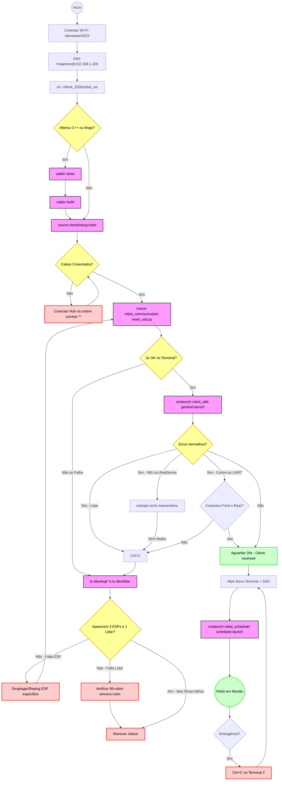

# RMA Jetson Robot Workspace


Este é o workspace principal (`robot_ws`) do bigas. Ele contém todos os pacotes necessários para a operação completa, desde a comunicação de baixo nível com microcontroladores até a inteligência de missão de alto nível.

---

## Sumário

1. [Acesso Remoto (SSH)](#ssh)
2. [Instalação e Build](#build)
3. [Estrutura do Workspace (Pacotes)](#pacotes)
4. [Esquemático de Operação Completo](#esquematico)

---

## <a id="ssh"></a>1. Acesso Remoto (SSH)

O robô opera em modo *headless* (sem monitor). Para interagir com ele, você deve se conectar via SSH.

### 1. Conexão com a Rede
Conecte o seu computador à rede Wi-Fi do roteador:
* **SSID:** `atenaopen2023`
* **Senha:** `rrrmmmaaa`

### 2. Identificação de IP
Embora os IPs dos dispositivos principais sejam fixos, é útil saber diagnosticar a rede.

1.  Descubra o seu próprio IP e máscara de sub-rede:
    ```bash
    ip a
    ```
    *(Procure pela interface Wi-Fi, ex: `wlan0` ou `wlp2s0`. Suponha que seja 192.168.1.13)*

2.  Escaneie a rede para encontrar os dispositivos conectados:
    ```bash
    # Exemplo escaneando toda a faixa 192.168.1.X
    nmap -sn 192.168.1.0/24
    ```

    Assim, excluindo seu próprio IP é possível tentar identificar qual é o do microcontrolador.

### 3. Endereços Fixos e Senhas
Para agilizar a operação, os dispositivos da equipe possuem IPs estáticos configurados no roteador:

| Dispositivo | IP Fixo | Usuário | Senha | Função |
| :--- | :--- | :--- | :--- | :--- |
| **Jetson Nano** | `192.168.1.100` | `rmajetson` | `rmajetson` | Usado nos projetos técnicos |
| **Raspberry Pi** | `192.168.1.101` | `ubuntu` | `rmarasp` | Usado no PB |

### 4. Acessando o Terminal
Abra o terminal do seu computador e digite:

```bash
# Acesso à Jetson (Principal)
ssh rmajetson@192.168.1.100
```
*(Digite a senha `rmajetson` quando solicitado e aceite com "yes" caso queira salvar a fingerprint da conexão)*

> [!TIP]
> **Dica de Produtividade: Acesso Visual via VS Code (Remote SSH)**
>
> Para editar scripts com conforto e transferir pastas inteiras (arrastar e soltar) sem usar comandos complexos como `scp`, utilize o **VS Code**:
>
> 1.  **Instalação:** Abra o VS Code no seu computador, vá na aba de Extensões (`Ctrl+Shift+X`), procure por **"Remote - SSH"** (da Microsoft) e instale.
> 2.  **Conexão:**
>     * Clique no novo ícone **"Remote Explorer"** (semelhante a um monitor) que apareceu na barra lateral esquerda.
>     * No topo da aba lateral, certifique-se de que a caixa de seleção está em **"Remotes (Tunnels/SSH)"**.
>     * Clique no botão **"+" (New Remote)** que aparece ao passar o mouse sobre a categoria *SSH*.
>     * Uma caixa de texto abrirá no topo da tela. Digite o comando de conexão: `ssh rmajetson@192.168.1.100` e aperte **Enter**.
> 3.  **Configuração (Pulo do Gato):**
>     * O VS Code perguntará qual arquivo de configuração atualizar. **Apenas aperte Enter na primeira opção** que aparecer (geralmente algo como `.../.ssh/config`).
>     * Uma notificação "Host added!" aparecerá no canto inferior direito. Clique em **"Connect"** (ou vá na lista da esquerda, clique com o botão direito no IP `192.168.1.100` e selecione *Connect in Current Window*).
> 4.  **Autenticação:**
>     * Se perguntar a plataforma, selecione **"Linux"**.
>     * Quando pedir a senha, apenas digite e confirme. No nosso caso é: `rmajetson`.
> 5.  **Uso:**
>     * Uma vez conectado (o canto inferior esquerdo ficará verde), clique em **"Open Folder"** e navegue até `/home/rmajetson/Work_2026/robot_ws`.
>     * **Transferência de Arquivos:** Agora você pode arrastar arquivos ou pastas inteiras do seu computador para a árvore de arquivos do VS Code para enviá-los para o robô instantaneamente.

---

## <a id="build"></a>2. Instalação e Build

Utilizamos o `catkin_tools` (ao invés do `catkin_make`) para compilação paralela e isolada.

### Procedimento de Compilação
Sempre que fizer alterações no código C++ ou adicionar novas mensagens ROS:

1.  Vá para a raiz do workspace:
    ```bash
    cd ~/Work_2026/robot_ws
    ```

2.  Limpe resíduos de compilações anteriores (opcional, mas recomendado para evitar conflitos de cache):
    ```bash
    catkin clean
    ```

3.  Compile o projeto:
    ```bash
    catkin build
    ```
    *(Se houver erros, o terminal indicará exatamente qual pacote falhou).*

4.  Carregue as variáveis de ambiente:
    ```bash
    source devel/setup.bash
    ```

5.  **Permissões:** Garanta que todos os scripts Python de todos os pacotes sejam executáveis:
    ```bash
    chmod +x src/*/scripts/*.py
    ```

### Automatizando o `source` (Recomendado)
Para não precisar digitar `source devel/setup.bash` toda vez que abrir um terminal novo, adicione o comando ao seu `.bashrc`.

1.  Abra o arquivo de configuração do terminal:
    ```bash
    sudo nano ~/.bashrc
    ```
2.  Vá até o final do arquivo (use as setas do teclado).
3.  Adicione a seguinte linha (ajuste o caminho se necessário):
    ```bash
    source ~/Work_2026/robot_ws/devel/setup.bash
    ```
4.  **Salvar e Sair:**
    * Pressione `CTRL + X`.
    * Pressione `Y` (Sim) para confirmar.
    * Pressione `Enter` para manter o mesmo nome do arquivo.

Agora, todo novo terminal aberto via SSH já reconhecerá os comandos do robô (`roslaunch robot_utils...`, etc).

> [!NOTE]
> Se você acabou de compilar (`catkin build`) no terminal atual, você ainda precisa dar o `source devel/setup.bash` manual **neste** terminal específico para ele enxergar as mudanças, ou fechá-lo e abrir um novo.

---

## <a id="pacotes"></a>3. Estrutura do Workspace

Este workspace é modular. Cada funcionalidade está isolada em seu próprio pacote. Clique nos links para ver a documentação detalhada de cada módulo.

### Controle e Missão
* [**`robot_scheduler`**](src/robot_scheduler/README.md): O "Cérebro". Máquina de estados que gerencia a missão completa, sequenciando navegação, manipulação e tarefas.
* [**`robot_utils`**](src/robot_utils/README.md): O "Canivete Suíço". Contém o **`general.launch`** (Bring-up geral), regras de udev e scripts de utilidade.

### Comunicação e Sensoriamento
* [**`robot_communication`**](src/robot_communication/README.md): A ponte (Bridge). Gerencia a comunicação UART/MQTT com as ESP32 e define as mensagens customizadas (`.msg`).
* [**`robot_vision`**](src/robot_vision/README.md): Detecção de AprilTags e processamento de imagem.

### Atuação e Movimento
* [**`robot_movement`**](src/robot_movement/README.md): Odometria, cinemática omnidirecional e scripts de alinhamento fino (ultrassom/visual).
* [**`robot_navigation`**](src/robot_navigation/README.md): Stack de navegação autônoma (MoveBase, AMCL, Gmapping) e gerenciamento de mapas.
* [**`robot_manipulation`**](src/robot_manipulation/README.md): Controle do braço robótico e garra.

### Modelo
* [**`robot_description`**](src/robot_description/README.md): Arquivos URDF/Xacro descrevendo a física e visualização do robô.

## <a id="esquematico"></a>4. Esquemático de Operação Completo

Um esquemático de procedimento, de forma simplificada e mais generalizada pode ser visto abaixo. Ainda é indicado que leia os pacotes específicos para melhor compreensão e conhecimentos práticos.



### Legenda do Fluxograma

* **Rosa (Comandos):** Ações que você deve digitar no terminal.
* **Amarelo (Decisões):** Pontos onde você deve olhar para a tela e verificar algo.
* **Vermelho (Erro/Debug):** Ações corretivas quando algo dá errado.
* **Verde (Sucesso/Progresso):** Estados onde o sistema está estável.
* **Azul (Hardware):** Verificações físicas.
* \** [Ordem correta](https://github.com/Grupo-SEMEAR-USP/Work_2026/blob/master/robot_ws/src/robot_communication/README.md#2-configura%C3%A7%C3%A3o-cr%C3%ADtica-de-hardware-usb-topology)

Este diagrama resume visualmente todo o conhecimento "tribal" que inserimos nos READMEs (como a questão da topologia do Hub, o delay da navegação e o reset obrigatório das USBs).
